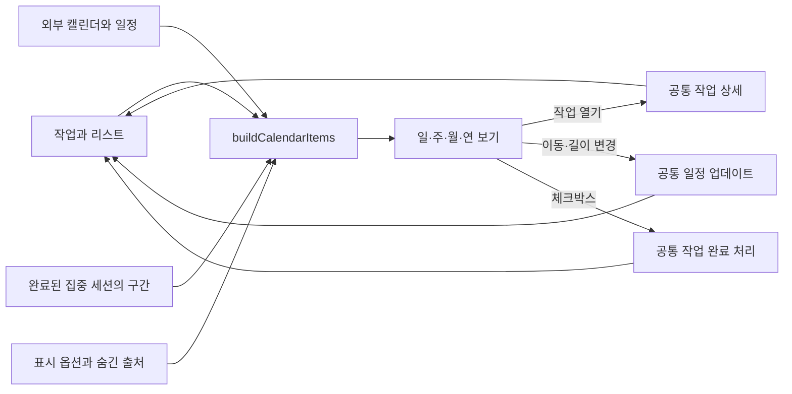

# FocusFlow Calendar Blueprint — 0.22.8

기준: 2026-09-06, 배포 태그 `v0.22.8`, 커밋 `c5c5326`.

이 문서는 현재 소스의 화면·이벤트·저장 연결을 분석한 현황 블루프린트다. 과거 설계서의 계획을 구현 완료로 간주하지 않는다. 로그인한 외부 계정 연동이나 모든 조작을 이번 분석에서 실기기로 재검증한 것은 아니다. 코드에서 확인한 결함과 추가 검증 대상은 마지막에 분리했다.

## 1. 제품 구조

캘린더는 별도 일정 데이터베이스가 아니라 **작업의 일정, 외부 구독 일정, 완료된 집중 구간을 날짜와 시간으로 투영하는 화면**이다.



- 진입 경로: `/calendar`.
- 최초 보기: 주 보기, 기준 날짜: 기기 기준 오늘.
- 캘린더 안의 작업 변경은 오늘·리스트·매트릭스 등에서 사용하는 같은 작업을 변경한다.
- 화면의 ‘개인 캘린더’는 계정의 리스트다. 독립적인 캘린더 전용 작업 분류가 아니다.
- 날짜가 없는 작업은 시간표에 그려지지 않는다. 현재 오른쪽 미예약 작업 패널은 없다.

## 2. 기본 화면 구성

```text
앱 전역 탐색
└─ 캘린더
   ├─ 상단: 이전 / 오늘 / 다음 | 현재 기간 | 일 / 주 / 월 / 연 | ⋯
   └─ 본문
      ├─ 왼쪽 열
      │  ├─ 만들기 / 접기
      │  ├─ 개인 리스트
      │  ├─ 외부 구독 캘린더
      │  ├─ 집중 기록 출처
      │  └─ 미니 월 달력
      └─ 메인
         ├─ 일·주: 날짜 헤더 / 종일 영역 / 시간 그리드
         ├─ 월: 날짜 셀 / 일정 칩 / 더 보기
         └─ 연: 12개 미니 월 / 날짜별 항목 밀도

일시적 화면: 작업 상세, 일정 카드, 날짜별 목록, 생성 폼, 보기 옵션
```

### 상단 도구막대

| 컨트롤 | 실제 동작 |
|---|---|
| 이전·다음 | 일: 하루, 주: 7일, 월: 한 달, 연: 12개월 이동 |
| 오늘 | 보기 종류를 유지하고 기준 날짜만 오늘로 이동 |
| 기간 제목 | 현재 날짜/주간 범위/월/연도 표시. 날짜 선택 드롭다운은 아님 |
| 일·주·월·연 | 보기 전환. 선택 항목·초안·팝오버는 초기화 |
| ⋯ | 색상 기준, 완료 작업 표시, 집중 기록 표시 |

캘린더 전용 검색창은 없다. 앱 전역 검색과 별개다. 데스크톱의 상단은 창 드래그 영역을 겸하며 창 제어 버튼 공간을 확보한다.

### 왼쪽 열

| 요소 | 동작 / 데이터 영향 |
|---|---|
| 만들기 | 선택 날짜의 09:00–10:00을 초기값으로 생성 폼 열기. 아래 결함 항목 참고 |
| 접기 | 좁은 아이콘 열로 전환. 펼치기와 + 생성 버튼 유지 |
| 개인 리스트 행 | 다음 작업이 들어갈 기본 리스트 선택. 숨긴 리스트면 다시 표시 |
| 출처 체크박스 | 해당 출처만 숨기거나 표시. 기본 생성 리스트는 변경하지 않음 |
| 리스트 ⋯ 색상 | 프리셋 또는 사용자 색상. 원본 List.color 변경으로 다른 화면에도 영향 |
| 외부 출처 행 | 읽기 전용 안내. 새 작업의 소속으로 선택 불가 |
| 외부 출처 색상 | ExternalCalendar.color 변경 |
| 집중 기록 출처 | 읽기 전용. 표시 여부와 집중 색상을 조절 |
| 미니 달력 날짜 | 기준 날짜 변경. 현재 보기 종류 유지 |

Inbox가 먼저, 나머지는 리스트 순서와 이름으로 정렬된다. 보관·삭제된 리스트는 출처 목록에서 제외된다. 미니 달력은 오늘·선택 날짜·항목이 있는 날짜를 구별한다.

## 3. 보기별 기능

| 기능 | 일 | 주 | 월 | 연 |
|---|---|---|---|---|
| 시간 위치로 일정 표시 | 가능 | 가능 | 시작 시간 텍스트 | 불가 |
| 종일 일정 표시 | 상단 영역 | 상단 영역 | 채워진 칩 | 날짜 밀도 |
| 빈 시간 클릭으로 초안 | 가능 | 가능 | 불가 | 불가 |
| 빈 시간 드래그로 초안 | 가능 | 가능 | 불가 | 불가 |
| 작업 시간 이동 | 가능 | 가능 | 날짜만 이동 | 불가 |
| 위·아래 가장자리 길이 변경 | 가능 | 가능 | 불가 | 불가 |
| 작업 체크박스 | 가능 | 가능 | 가능 | 불가 |
| 작업 상세 열기 | 가능 | 가능 | 칩 클릭 | 날짜를 통해 이동 |
| 겹친 일정 표시 | 옆 열로 나눔 | 옆 열로 나눔 | 칩 목록 | 개수 기반 밀도 |

### 일·주 보기

- 일 보기는 1개 날짜, 주 보기는 7개 날짜를 같은 시간 그리드로 그린다.
- 범위는 00:00–24:00. 한 화면에 보이는 시간 수는 설정에서 6–24시간, 기본 12시간이다.
- 실제 행 높이는 가용 높이에 맞춰 계산하며 4px 단위, 시간당 최소 44px를 유지한다. 좁은 높이에서는 스크롤한다.
- 날짜 헤더와 종일 영역은 스크롤 위쪽에 고정된다.
- 오늘이 포함되면 현재 시각 약 1시간 전으로, 포함되지 않으면 08:00 부근으로 초기 스크롤한다.
- 오늘의 현재 시각 선과 시간 라벨이 있다. 독립적인 분 단위 갱신 타이머는 WeekView에서 확인되지 않아 장시간 정지 화면에서는 갱신 검증이 필요하다.
- 같은 시간대의 항목은 겹침 그룹을 만들고 여러 열로 분할한다. 겹침을 일정 오류로 차단하지 않는다.
- 종일 영역 아래 경계를 끌어 높이를 32–320px로 바꿀 수 있다. 기기에 저장된다.
- 일정이 없을 때 생성 안내를 표시하며 초안/선택 중에는 안내를 감춘다.

### 월 보기

- 전후 월의 날짜를 포함하는 월 그리드다. 오늘·선택 날짜·드롭 대상·월 바깥 날짜를 구분한다.
- 시간 없는 항목은 채워진 칩, 시간 있는 항목은 점·제목·시작 시간 형태다.
- 셀 높이를 측정해 표시 가능한 칩 수를 계산한다. 고정 개수로 잘라내지 않는다.
- 초과 항목은 `+N 더 보기`로 해당 날짜 목록을 연다.
- 셀의 빈 배경 클릭은 날짜 선택, 더블클릭은 그 날짜의 일 보기로 이동한다. 즉시 작업을 생성하는 동작은 아니다.
- 이동 가능한 작업 칩을 다른 날짜에 드롭하면 날짜를 바꾸고 기존 시간을 유지한다.
- 기간 작업은 날짜마다 개별 칩으로 나타나며 월 전체를 가로지르는 하나의 연결 막대는 아니다.

### 연 보기

- 12개 월을 미니 달력으로 보여준다. 일정 제목·시간·체크박스는 표시하지 않는다.
- 월 제목 클릭 → 해당 월 보기. 날짜 클릭 → 해당 일 보기.
- 날짜의 항목 수에 따라 배경 밀도를 표시하며 5개에서 색 농도가 포화된다. 툴팁에는 실제 개수를 표시한다.
- 밀도는 집중 시간 합계나 고유 작업 수가 아니라 **필터를 통과한 CalendarItem 개수**다. 한 집중 세션의 여러 구간도 따로 계산될 수 있다.
- 주 시작일 설정과 외부 반복 일정의 연간 범위에 제약이 있다. §11 참고.

## 4. 생성 흐름

### A. 빈 시간 클릭·드래그

1. 일/주 보기의 빈 시간 영역에서 포인터를 누른다.
2. 이동량 4px 이하는 클릭으로 보아 기본 1시간 초안을 만든다.
3. 드래그는 시작을 15분 아래 단위, 종료를 15분 위 단위에 맞춘다. 최소 15분이며 하루 범위에 제한한다.
4. 확정된 초안 옆에 생성 폼을 연다. 이때는 실제 작업이나 로컬 저장 데이터를 만들지 않는다.
5. 제목, 소속 리스트, 선택적 종료 날짜를 입력한다. 선택한 날짜와 시간은 폼에 표시한다.
6. 저장하면 실제 Task를 생성하고 해당 리스트를 표시·활성 상태로 만든다.
7. 취소·Esc·다른 빈 영역 선택·보기/기간 이동으로 초안을 버릴 수 있다.

제목이 비어 있으면 기본 제목을 사용한다. Enter 제출 시 한국어 IME 조합 확정을 구별한다. 추가 날짜 선택기가 열려 있을 때 그 안의 Esc/Enter가 상위 폼까지 취소/제출하지 않도록 처리한다.

초안 날짜보다 나중인 종료 날짜를 고르면 기간 일정으로 저장한다. 생성 폼의 날짜 선택기는 날짜 전용이며 시간·알림·반복은 이 폼에서 설정하지 않는다.

### B. 만들기·종일 영역

- 왼쪽 만들기: 제목·날짜·시작 시간·종료 시간·리스트를 받는 모달.
- 종일 빈 영역: 날짜·제목·리스트를 받으며 시간 입력은 숨긴다.
- 취소/저장, 제목 기본값, Enter 처리가 있다.
- **이 경로는 현재 저장 함수 호출 인자가 어긋나 있어 정상 생성 완료 기능으로 간주하면 안 된다. §11-1 참고.**

## 5. 작업 조작과 수정 규칙

| 조작 | 변경 대상 | 보존/제약 |
|---|---|---|
| 일반 작업 블록 클릭 | 공통 작업 상세 열기 | 선택 테두리 표시, 클릭한 리스트를 다음 생성 기본값으로 선택 |
| 체크박스 | 공통 toggleTaskDone | 완료 시각과 반복 처리 규칙을 공통 작업 로직에 위임 |
| 완료 체크 해제 | 같은 공통 완료 전환 | 단순 status 필드 직접 수정 경로가 아님 |
| 시간 블록 몸체 드래그 | 날짜·시작·종료 시간 | 잡은 위치와 길이를 유지, 15분 스냅 |
| 위·아래 끝 드래그 | 시작 또는 종료 시간 | 최소 15분. estimatedMinutes도 새 길이로 갱신 |
| 시간 → 종일 드롭 | 날짜 유지/이동, 시간 제거 | 종일 일정으로 변환 |
| 종일 → 시간 드롭 | 날짜와 시간 부여 | 예상 시간 우선, 기존 시간 길이, 우선순위별 기본 길이 사용 |
| 월 칩 날짜 이동 | 일정 날짜 | 기존 시간·알림·반복 등 현 일정 값을 보존 |
| 선택 후 Delete/Backspace | 공통 작업 삭제 요청 | 앱의 삭제 확인 설정을 따름. 외부/집중 기록에는 적용 안 됨 |

이동은 화면 가장자리에서 자동 스크롤을 지원한다. 완료 작업, 기간 작업, 외부 구독 일정, 집중 기록은 드래그 대상이 아니다. 기간 일정은 공통 일정 편집기에서 바꾼다.

이동·리사이즈는 `onUpdateTaskSchedule`을 통해 쓰며, 겹치는 시간도 허용한다. 자동으로 빈 시간으로 밀거나 충돌을 해결하지 않는다. 시간표 재배치가 캘린더만의 복사본을 만드는 것은 아니다.

## 6. 블록 유형과 표시 계약

| 종류 | 원본 | 표시 조건 | 수정 |
|---|---|---|---|
| 작업 | Task + List | 살아 있는 날짜 보유 작업, 출처 필터 통과 | 공통 작업 상세, 조건부 드래그, 완료, 삭제 |
| 완료 작업 | 같은 Task | 완료 작업 표시 ON | 완료 모양, 드래그 불가 |
| 외부 구독 일정 | ExternalCalendarEvent | 캘린더 enabled + visible, 출처 필터 통과 | 카드 조회만 |
| 집중 실적 | FocusSession.segments | 완료 세션 + mode=focus, 집중 표시 ON | 카드 조회만 |

### 날짜·기간

- 과거 작업일/마감일의 별도 두 블록이 아니라 통합 일정으로 표시한다.
- 날짜가 없는 작업은 제외한다. 날짜만 있으면 종일, 시작 시간이 있으면 시간 항목으로 처리한다.
- 기간 작업은 양 끝을 포함해 하루씩 투영한다. 시작 시간은 첫날, 종료 시간은 마지막 날에만 적용하고 중간 날짜는 종일이다.
- 손상된 기간으로 무한히 항목을 만들지 않도록 작업/외부 종일 확장은 62일 상한을 둔다.
- 작업 반복은 반복 표식을 표시한다. 현재 작업 투영 루프 자체가 미래 반복 작업을 무한히 미리 생성하는 것은 아니다.

### 집중 기록

- 완료된 집중 세션의 실제 실행 구간만 사용한다. 진행 중·일시정지 중인 세션과 휴식은 표시하지 않는다.
- 자정을 넘으면 날짜별 블록으로 나눈다. 기본은 기기 시간대, 서버 호출자는 viewerTimezone을 전달할 수 있다.
- 1분 미만의 실행도 시각적으로 최소 1분 조각으로 표시할 수 있으므로 블록 면적이 초 단위 기록 총합과 완전히 같지는 않다.
- 구간 없는 과거 기록에는 임의의 시간 블록을 만들지 않는다.
- 작업 미지정 집중은 중립색으로 표시한다. 그리드에서 옮기거나 길이를 늘릴 수 없다.

### 색상

- 기본 기준: 리스트. 선택 가능 기준: 리스트 / 우선순위.
- 외부 일정은 외부 캘린더 색, 집중 기록은 집중 색을 사용한다.
- 개인 리스트의 채워진 블록은 흰 글자의 대비를 위해 색을 어둡게 보정한다. 입력한 원색과 화면 색이 다를 수 있다.
- 같은 출처인지 색으로, 완료·반복·집중 등 상태는 체크·표식·스타일로 함께 표현한다.
- ‘리스트 색 바꾸기’는 리스트 전체에 영향이 있고, ‘작업을 다른 리스트로 옮기기’는 작업 소속 변경이다.

## 7. 상세 화면과 팝오버

| 진입 | 도착 | 세부 사항 |
|---|---|---|
| 일반 작업 칩/시간 블록 | 공통 작업 상세 | 앱의 동일 Task 편집 화면을 블록 근처에 열기 |
| 외부·집중 블록 | EventPopover | 제목·날짜·시간·출처 등 조회, 읽기 전용 |
| 월 보기 더 보기 | DayAgendaPopover | 그 날짜의 모든 CalendarItem 목록 |
| 더 보기 목록 안 작업 | EventPopover | 일반 클릭과 달리 캘린더 간편 카드로 연결되는 현재 차이 |
| 초안 확정 | NewTaskForm | 초안 근처 생성 팝오버 |
| 왼쪽 만들기·종일 클릭 | QuickCreatePopover | Modal 기반 생성 화면 |

간편 카드의 작업 분기에는 시간·메모 빠른 수정, 리스트 이동, 삭제가 남아 있다. 따라서 ‘작업 클릭은 항상 공통 상세’라는 계약이 모든 경로에서 일치하지 않는다.

## 8. 설정과 저장 범위

| 설정/상태 | 범위 | 기본/효과 |
|---|---|---|
| colorBy | AppSettings.calendarViewOptions | list |
| showCompleted | 같은 계정 설정 | true. 과거 기기 설정 마이그레이션 고려 |
| showFocusRecords | 같은 계정 설정 | true |
| 활성 생성 리스트 | 캘린더 기기 저장소 | 유효하지 않으면 Inbox로 대체 |
| 숨긴 출처·집중 색상 | 캘린더 기기 저장소 | 계정 표시 옵션과 저장 범위가 다름 |
| 외부 visible/enabled/color | 외부 캘린더 상태 | enabled는 동기화/출처 참여, visible은 표시 여부 |
| 종일 영역 높이 | localStorage | 32–320px |
| 시간 형식 | 앱 설정 | 지역 기본 / 12시간 / 24시간 |
| 주 시작일 | 앱 설정 | 일요일 / 월요일. 연 보기 예외 존재 |
| 한 화면 시간 수 | 앱 설정 | 6–24, 기본 12 |
| 현재 보기·기준 날짜·좌측 접기 | 컴포넌트 상태 | 이 컴포넌트에는 영속 저장 없음 |
| 초안·선택·팝오버 | 일시 상태 | 저장된 일정이 아님 |

작업과 AppSettings는 공통 PlannerData 저장/계정 동기화 경로를 사용한다. 모든 캘린더 설정이 여러 기기에 따라가는 것은 아니다.

## 9. 외부 연동과 공유

### ICS 구독 — 외부 → FocusFlow

- 설정 → 캘린더에서 이름·ICS URL·색상으로 추가한다.
- webcal:// 주소는 https://로 정규화한다.
- 추가 시 동기화 요청, 수동 개별/전체 동기화, 활성화/비활성화, 제거, 상태·오류·일정 개수 표시가 있다.
- 마지막 동기화로부터 30분을 신선도 기준으로 사용한다. 정확히 매 30분 실행을 보장하는 백그라운드 서비스라는 뜻은 아니다.
- 웹 fetch와 데스크톱 플랫폼 fetch 경로가 있으므로 URL 접근성/CORS/네트워크에 따라 성공 여부가 달라질 수 있다.
- 가져온 일정은 읽기 전용이다. 숨김은 원격 일정 삭제가 아니다.
- 반복 일정은 ICS occurrence 확장 경로로 표시한다. 종일 DTEND는 마지막 날짜를 포함하지 않는 종료 경계로 처리한다.

### Google Calendar

- 설정 화면에 로그인 전제 연결, OAuth 결과 처리, 연결 상태, 연결 해제 확인 UI가 있다.
- 앱에서 확인되는 실행 경로는 `useGoogleOutboundSync`: 작업 변경 후 1.8초 디바운스와 창 재포커스 시 전송을 시도한다.
- 작업과 Google 이벤트 ID/ETag/동기화 시각을 연결하고 생성·수정·삭제·영구 삭제된 이벤트의 정리 계획을 수행한다.
- 로그인하지 않았거나 연결이 없으면 전송하지 않는다. 변경할 계획이 없으면 불필요한 요청을 생략한다.
- **설계/주석의 ‘양방향’ 표기만으로 완전한 양방향 동기화를 보장할 수 없다. 이번에 확인한 앱 실행 연결은 outbound이며, 원격 변경의 지속적인 inbound 반영은 별도 실행 경로 검증이 필요하다.**
- ICS 구독 일정과 Google 연결된 작업을 같은 읽기 전용 모델로 취급하면 안 된다.

### FocusFlow 일정 공유 — FocusFlow → 구독자

- 설정에서 공유 링크 생성, 복사, 즉시 갱신, 비활성화, 링크 재생성이 가능하다. 로그인/백엔드가 필요하다.
- 링크 형태는 `/api/calendar/{token}.ics`이며 토큰 기반 구독이다. 링크를 아는 사람이 읽을 수 있는 공유 모델이다.
- 현재 공유 스냅샷은 살아 있는 날짜 보유 작업의 제목·dueDate·시작/종료 시간을 작업당 하나의 이벤트로 만든다.
- 외부 구독 일정과 집중 구간을 그대로 합친 화면 전체를 내보내는 것은 아니다.
- startDate 기간, 반복 규칙, 알림 등 전체 일정 정보를 이 스냅샷 타입이 보존하지 않으므로 원본 편집과 동등한 완전 내보내기로 간주하지 않는다.

## 10. 키보드와 화면 크기

| 키 | 동작 |
|---|---|
| D / W / M / Y | 일 / 주 / 월 / 연 |
| ← / → | 현재 보기 기준 이전/다음 기간 |
| Home | 오늘 |
| Esc | 선택·초안·팝오버 해제. 열린 내부 팝오버는 자체 처리 |
| Delete / Backspace | 선택된 작업 삭제 요청 |
| Enter / Space | 포커스된 일정/출처 활성화 |

입력·텍스트 영역·선택 입력·contenteditable에서는 캘린더 단축키를 실행하지 않는다. Ctrl/Alt/Meta 조합은 브라우저와 OS에 양보한다. 모든 팝오버에서의 전역 단축키 차단은 실동작 검증이 필요하다.

캘린더 본문 가로폭이 640px 미만이면 주 → 일 보기로 자동 변경한다. 다시 넓어져도 주 보기로 자동 복귀하지 않는다. 월 칩의 HTML 드래그와 시간표의 포인터 드래그는 서로 다른 구현이므로 터치·키보드 조작 동등성은 별도 검증 대상이다.

## 11. 현재 결함·제약·미연결 기능

### 11-1. 높은 우선순위: 간편 생성의 인자 연결 오류

`scheduleFor(taskId, day, startTime, endTime)`를 간편 생성에서 `scheduleFor(result.date, result.startTime, result.endTime)`로 호출한다.

예를 들어 2026-09-06 09:00–10:00 생성 입력이 내부적으로 taskId=날짜, day=09:00, startTime=10:00, endTime=빈 값으로 전달된다. 날짜 대신 시간이 dueDate로 넘어가므로 정규화/검증에 따라 날짜 손실 또는 생성 실패가 발생할 수 있다. 정확한 사용자 증상은 재현 검증 대상이나 호출 계약 불일치는 코드에서 확인된다.

영향: 왼쪽 만들기, 접힌 열의 +, 종일 영역 생성. 드래그 초안의 `handleCreateFromDraft`는 별도 정상 인자 경로다.

### 11-2. 작업 상세 진입 경로 불일치

일반 블록은 `handleClickItem`을 통해 공통 상세로 가지만, 월 더 보기 목록은 `setPopover({kind: event})`를 직접 호출한다. 상세 화면, 메모 편집 방식, 리스트 이동 UI가 진입점에 따라 달라진다.

### 11-3. 연 보기 외부 반복 일정 범위

외부 recurrence 확장 범위는 기준 월의 전월 1일부터 다음 달 말일까지다. 연 보기에서도 같은 범위를 사용하므로 12개월의 반복 외부 일정 밀도를 완전하게 표시하지 못할 수 있다.

### 11-4. 연 보기 주 시작일

일·주·월·미니 달력은 주 시작 설정을 읽지만 YearView는 같은 훅을 사용하지 않고 기본 월 그리드를 호출한다. 월요일 시작 설정과 연 보기의 열 순서가 일치하지 않을 수 있다.

### 11-5. 집중 표시 옵션이 두 곳에 남음

보기 옵션의 showFocusRecords와 좌측 집중 출처 체크가 모두 필터에 참여한다. 하나만 켜도 다른 쪽이 숨김이면 기록이 보이지 않는다. 설정 설명과 달리 좌측에는 집중 그룹이 실제로 렌더링된다.

### 11-6. 시간·저장·접근성 추가 검증

- WeekView 현재 시각 선의 독립 주기 갱신은 확인되지 않았다.
- 화면 날짜 투영은 기본적으로 기기 시간대를 사용하지만 계정 시간대는 Google 전송/집중 통계 등에 별도로 사용된다. 기기·계정 시간대가 다른 경우 통일성 검증이 필요하다.
- 빠른 생성 time input의 step은 600초, 그리드 스냅은 15분으로 간격이 다르다.
- 월 셀 클릭/더블클릭은 빈 배경을 대상으로 제한되어 날짜 숫자 등 자식 요소를 클릭할 때 동일하게 작동하는지 확인이 필요하다.
- 드래그 이외의 공통 일정 편집은 가능하지만 시간 그리드의 빈 칸 키보드 생성 및 종일 높이 조절의 키보드 대체는 확인되지 않았다.

### 11-7. 제공 기능으로 계산하지 않을 것

- `suggestSchedule`과 AI placement preview 코드가 남아 있지만 호출 UI가 연결되지 않는다. 현재 자동 일정 추천 기능으로 표시하지 않는다.
- 제거된 오른쪽 미예약 작업 패널, 캘린더 전용 검색, 독립 개인 카테고리 CRUD를 현재 기능으로 표시하지 않는다.
- 휴일 자동 제공, 참석자 초대·응답, 회의실 예약, 여러 일정 일괄 드래그, 캘린더 인쇄/PDF는 이번에 확인한 캘린더 UI의 제공 기능이 아니다.

## 12. 후속 검증 체크리스트

1. 왼쪽 만들기·종일 생성·빈 시간 클릭·드래그 생성 네 경로의 저장 날짜/시간을 각각 검사한다.
2. 작업 일반 클릭과 더 보기 목록 클릭을 같은 상세 계약으로 맞춘다.
3. 완료·반복 작업 체크와 되돌림이 공통 작업 모델과 일치하는지 확인한다.
4. 단일일 이동, 기간 작업 제한, 시간↔종일 변환, 리사이즈의 예상 시간 갱신을 확인한다.
5. 월요일 시작과 1월/12월 경계에서 네 보기의 날짜 열을 검사한다.
6. 연 보기의 반복 외부 일정 범위를 12개월에 맞춰 검증한다.
7. 집중 기록 표시의 이중 필터와 구간/시간대 표시를 점검한다.
8. 실제 로그인 계정에서 ICS·Google·공유 링크를 각각 검증한다. 서로 다른 연동 경로다.
9. 저장 실패·오프라인·동기화 충돌·복구 뒤 캘린더의 변경 결과를 검사한다.
10. 마우스·터치·키보드와 좁은 화면에서 생성/편집/취소 경로를 확인한다.

## 13. 소스 지도

| 책임 | 파일 |
|---|---|
| 앱 데이터/작업 상세 연결 | `src/app/AppPages.tsx` |
| 캘린더 상태·조작·생성 | `src/components/CalendarView.tsx` |
| 상단·보기 옵션·좌측 | `src/components/calendar/CalendarToolbar.tsx`, `CalendarViewOptions.tsx`, `CalendarLeftSidebar.tsx` |
| 보기별 그리드 | `src/components/calendar/WeekView.tsx`, `MonthView.tsx`, `YearView.tsx` |
| 생성/조회 | `src/components/calendar/NewTaskForm.tsx`, `QuickCreatePopover.tsx`, `EventPopover.tsx` |
| 통합 일정 투영 | `src/utils/calendarItems.ts` |
| 시간 좌표·스냅 | `src/utils/calendarTime.ts` |
| 공통 일정 모델 | `src/domain/schedule/` |
| 출처·로컬 설정 | `src/lib/calendarCategories.ts`, `src/lib/calendar/categoryModel.ts` |
| 색·보기 옵션 | `src/domain/calendar/itemColor.ts`, `readableInk.ts`, `viewOptions.ts` |
| 외부 구독 | `src/lib/externalCalendars.ts`, `src/App.tsx` |
| Google 연결/전송 | `src/components/calendar/GoogleCalendarCard.tsx`, `src/hooks/useGoogleOutboundSync.ts`, `src/lib/googleCalendarOutbound.ts` |
| 공유 | `src/lib/calendarShare.ts`, `api/calendar/[token].js` |
| 관련 브라우저 테스트 | `e2e/calendarCreate.spec.ts`, `calendarCheckbox.spec.ts`, `calendarLayout.spec.ts` |

이번 작업은 분석 문서 작성이며, 위 결함의 코드 수정이나 추가 배포는 수행하지 않았다.
