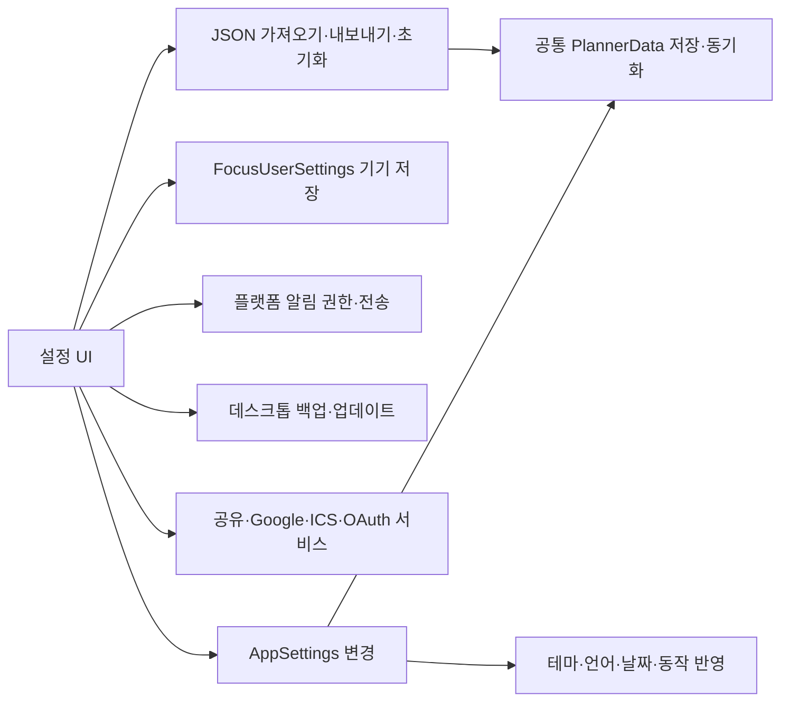

# FocusFlow Settings Blueprint — 0.22.8

기준: 배포 태그 `v0.22.8`, 커밋 `c5c5326`. 현재 소스의 UI와 저장 연결을 기준으로 분석했다. 외부 계정 권한 변경·백업·초기화를 실제로 실행한 문서는 아니다. 코드 수정과 추가 배포는 하지 않았다.

## 1. 전체 구성

```text
/settings
├─ 설정 제목 / 설명
├─ 하위 탭 선택
│  계정 | 외관 | 동작 | 알림 | 캘린더 | 집중 | 데이터
└─ 선택한 탭의 설정 카드
   ├─ 항목 제목 + 설명
   └─ 선택 버튼 / 토글 / 입력 / 실행 버튼 / 상태
```

- 기본 진입 탭은 계정이다.
- Google Calendar OAuth 콜백이나 진행 중인 연결 정보가 있으면 캘린더 탭으로 진입한다.
- 선택한 하위 탭은 컴포넌트 상태다. 마지막 탭 영속 저장이나 일반적인 탭별 URL 지정은 이 구현에 없다.
- 일반 환경설정은 값을 바꾸면 콜백을 통해 반영한다. 페이지 전체의 별도 저장/취소 버튼은 없다.
- 연결·백업·업데이트·가져오기 등은 실행형 작업이며 각기 다른 상태와 오류 표시를 사용한다.
- 데스크톱의 상단 헤더는 창 드래그 영역을 겸한다.

## 2. 계정 탭

### 계정 및 동기화 카드

| 상태/컨트롤 | 실제 동작 |
|---|---|
| 로그인 상태 | 계정 이메일 표시 |
| 로그아웃 상태 | 로그인/가입 화면 `/login`으로 이동 |
| 백엔드 미설정·인증 로딩 | 로그인 버튼 비활성화 |
| 클라우드 새로고침 | `refreshSupabaseData` 실행 |
| 로그아웃 | 공통 `signOut` 실행 |
| 로컬 데이터 이전 대상 존재 | 대상 개수와 로컬 데이터 업로드 버튼 표시 |
| 업로드 | `uploadLocalDataToSupabase` 결과 안내 |
| 동기화 상태/오류 | 공통 auth.syncStatus / auth.syncError 표시 |

계정 정보 수정·비밀번호 변경·계정 삭제를 이 카드에서 직접 제공하는 구조는 아니다. 로그인/가입은 별도 인증 화면이다.

### 연결된 AI 카드

- Supabase OAuth grant 목록을 읽어 연결한 클라이언트 이름과 권한 부여 날짜를 보여준다.
- 연결 해제는 해당 clientId의 grant를 철회하는 요청이다. 실행 중 그 클라이언트 버튼을 잠근다.
- 로그아웃·연결 없음·조회 오류·철회 성공/실패를 구별한다.
- 이 카드는 AI 모델 선택이나 앱 내 AI 채팅 설정이 아니라 **외부 클라이언트의 계정 접근 권한 관리**다.
- 현재 UI는 해제 버튼에서 바로 철회를 요청하며 별도 확인 모달은 없다.

### 앱 정보 및 업데이트

- 앱 이름 FocusFlow와 버전을 표시한다.
- 데스크톱에서 업데이트 확인, 새 버전이 있으면 설치 버튼을 제공한다.
- 상태: 미확인 → 확인 중 → 최신/새 버전 있음/실패 → 설치 중.
- 확인/설치 중에는 업데이트 확인 버튼을 비활성화한다.
- 웹은 설치형 업데이트 버튼 대신 웹 업데이트 안내를 표시한다.

## 3. 외관 탭

| 항목 | 선택지 | 기본값 / 영향 |
|---|---|---|
| 테마 | 밝게 / 어둡게 / 시스템 | 신규 기본은 밝게. 앱 전체 테마 |
| 강조색 | 파랑 / 보라 / 초록 / 주황 / 분홍 | 파랑. 앱의 강조 색상 |
| 언어 | 한국어 / 영어 | 초기 환경에서 감지. 공통 번역과 날짜 표시 |
| 시간 형식 | 지역 기본 / 12시간 / 24시간 | 지역 기본 |
| 주 시작일 | 일요일 / 월요일 | 일요일 |

각 항목은 AppSettings에 반영된다. 테마·강조색·시간·주 시작일 등은 루트의 속성 및 공통 설정 소비 경로를 통해 각 화면에 전달된다.

글자 크기 선택은 현재 UI에서 제거되어 있다. 과거 fontSize 필드가 남아 있다고 해서 사용자가 여기서 크기를 조절할 수 있는 것은 아니다.

주 시작일과 시간 형식이 모든 화면에 완전히 동일하게 반영되는지는 별개다. 캘린더 연 보기 및 타임라인의 주 정렬에는 앞서 작성한 블루프린트의 예외가 있다.

## 4. 동작 탭

| 항목 | 선택/동작 | 연결 |
|---|---|---|
| 시작 페이지 | 오늘 / 캘린더 / `/board` 화면 / 집중 / Inbox | 앱 시작·기본 경로 이동에 사용 |
| 삭제 전 확인 | 켜기/끄기, 기본 켜기 | 공통 작업 삭제 요청에서 확인 모달 여부 결정 |
| 동작 줄이기 | 켜기/끄기, 기본 끄기 | 애니메이션을 줄이는 앱 설정 |

- 과거 `/planning` 값은 선택기에서 `/board`로 표시한다.
- 삭제 전 확인을 꺼도 모든 파괴적 기능의 확인이 사라지는 것은 아니다. 데이터 전체 초기화는 별도 확인을 요청한다.
- 과거 ‘오늘 화면에 완료 작업 표시’는 이 탭에서 제거되었다. 완료 표시 여부는 관련 작업 화면의 보기 옵션에서 다룬다.
- 시작 페이지 선택은 현재 보고 있는 화면을 즉시 강제로 바꾸는 컨트롤이 아니라 기본 진입 경로 설정이다.

## 5. 알림 탭

### 권한 상태

| 권한 | 표시와 가능한 조작 |
|---|---|
| unasked | 권한 안내와 허용 요청 버튼 |
| granted | 허용 상태, 테스트 알림 가능 |
| denied | 거부 안내. 다시 요청하는 무효 버튼 대신 브라우저/OS 설정 안내 |
| unsupported | 현재 플랫폼에서 미지원 안내 |

### 테스트 알림

- 허용 상태에서만 활성화한다.
- `platform.notify`로 테스트 제목·본문을 전송하고 결과를 표시한다.
- API의 전송 성공이 실제 배너 노출을 보증하지는 않는다. OS 방해금지·브라우저 설정의 영향은 별도다.
- 이 탭에 방해금지 시간대, 알림 유형별 전체 설정, 작업별 알림 편집기는 없다. 작업 알림은 작업 일정 편집 경로, 집중 완료 알림 토글은 집중 탭에 있다.

## 6. 캘린더 탭

카드 순서: 일반 → 색상 → 공유 → Google 연결 → 외부 ICS 구독.

### 일반

- 한 화면에 표시할 시간 수: 6–24시간, 기본 12시간.
- 캘린더 일/주 시간표의 행 높이 계산에 사용한다. 데이터의 하루 길이나 일정 시간을 바꾸지 않는다.

### 캘린더 색상

- 외부 구독 캘린더 색과 집중 기록 색을 관리한다.
- 프리셋/사용자 색상 편집을 제공한다.
- 개인 리스트의 생성·이름·삭제 등 독립 캘린더 분류 CRUD는 없다. 개인 일정 분류는 원본 리스트에서 관리한다.

### 구독 링크 공유

| 컨트롤 | 동작 |
|---|---|
| 공유 링크 만들기 | 공유 활성화 및 토큰 기반 ICS 링크 생성 |
| 복사 | 클립보드 복사, 성공/실패 문구를 1.5초 표시 |
| 즉시 업데이트 | 현재 공유 스냅샷 게시 |
| 링크 재생성 | 공유 토큰 갱신 경로 실행 |
| 공유 끄기 | 공유 비활성화 |
| 상태 | 켜짐/꺼짐, 마지막 게시 시각, 오류, 로그인 필요 |

로그인 및 백엔드가 필요하다. 로딩/저장 중에는 관련 버튼을 잠근다. 토큰을 아는 사람이 읽을 수 있는 공유 모델이며 화면 전체의 복제나 공동 편집 기능은 아니다.

### Google Calendar 연결

- 연결 시작, OAuth 복귀 처리, 연결 상태, 연결 해제 확인 UI가 있다.
- 계정 연결에 관한 카드이며 ICS URL 구독과 다른 경로다.
- 작업의 Google 전송은 공통 outbound 동기화 훅과 이어진다. 완전한 양방향 동기화 여부는 별도 inbound 경로 검증이 필요하다.
- OAuth 복귀 시 이 카드가 동작할 수 있도록 설정의 최초 탭을 캘린더로 선택한다.

### 외부 ICS 구독

- ‘추가’로 이름·ICS URL·색상 폼을 펼친다. 이름과 URL이 비면 추가 버튼이 잠긴다.
- 추가 후 폼을 초기화하고 접는다. 실제 읽기 성공 여부는 동기화 상태로 확인한다.
- 구독마다 이름·색·일정 개수·마지막 동기화 시각·실패 이유를 표시한다.
- 표시/숨김, 활성화/비활성화, 즉시 갱신, 제거가 가능하다.
- 활성화와 표시는 별개다. 비활성화 상태에서는 개별 갱신 버튼이 잠긴다.
- 구독이 있을 때만 전체 새로고침과 최근 동기화 요약을 표시한다.
- 제거는 구독을 앱에서 제거하는 작업이며 외부 서비스 원본 일정을 삭제하는 기능이 아니다.

## 7. 집중 탭

| 항목 | 실제 기능 | 플랫폼/기본값 |
|---|---|---|
| 타이머 측정 방식 안내 | 집중 화면에서 모드를 선택하라는 설명 | 기본 스톱워치, 여기서 선택하는 컨트롤은 아님 |
| 브라우저 탭 타이머 | document.title 시간 표시 제어 | 웹만 표시, 기본 켜짐 |
| 집중 완료 알림 | 집중 종료 알림 설정 | 기본 켜짐. OS/브라우저 권한은 별도 |
| 미니 타이머 버튼 | 미니 타이머 버튼 표시 설정 | 기본 켜짐 |

이 토글은 AppSettings가 아닌 기기 저장소 `focusflow.focusSettings.v1`을 사용한다.

포모도로 집중 시간·짧은 휴식·긴 휴식·긴 휴식 간격·자동 시작·소리·음량은 **집중 화면 안의 설정**에서 조절한다. 이 탭 안에 같은 편집기를 복제하지 않는다. 저장 모델은 공통 FocusUserSettings를 사용하며 음량 기본은 0.4, 소리 기본은 켜짐이다.

## 8. 데이터 탭

### 자동 백업 — 데스크톱 전용

| 항목 | 선택 / 동작 |
|---|---|
| 주기 | 끄기 / 매일 / 매주, 기본 끄기 |
| 보관 개수 | 3 / 7 / 14 / 30개, 기본 7개 |
| 마지막 백업 | 성공 시각, 아직 없음, 실패 이유 |
| 폴더 열기 | 플랫폼의 백업 폴더 표시 |
| 지금 백업 | 현재 데이터를 JSON 파일로 저장. 실행 중 버튼 잠금 |

- 웹에서는 자동 백업 선택기를 비활성화하고 데스크톱 전용임을 안내한다.
- 보관 개수는 지원 플랫폼에서 자동 백업이 켜져 있을 때 표시한다.
- ‘지금 백업’은 자동 주기와 별개로 실행할 수 있다.
- 자동 실행기는 시작 약 5초 뒤와 이후 1시간마다 기한 도래 여부를 검사한다.
- 매일/매주는 마지막 성공 이후 경과 시간 기준이며 특정 시각에 실행하는 OS 예약 작업이 아니다. 앱이 종료되어 있으면 이 훅은 실행되지 않는다.
- 마지막 백업 시각은 기기별 `focusflow.backup.lastAt.v1`에 보관한다. 다른 기기의 백업이 이 기기의 백업을 대신하지 않는다.
- 파일 내용은 수동 JSON 내보내기와 같은 PlannerData 형식이며 가져오기로 복구한다.

### 수동 내보내기

- 공통 `exportData()`로 정규화한 PlannerData를 JSON으로 직렬화한다.
- 파일명: `todo-planner-backup-YYYY-MM-DD.json`.
- 작업·리스트·집중 기록·계정 환경설정 등 PlannerData에 포함된 데이터를 다룬다.
- 플랫폼 권한, 로그인 토큰, 기기 전용 집중 설정, 외부 연결의 모든 상태까지 통째로 담는 완전한 기기 이미지가 아니다.

### 가져오기

1. JSON 파일 선택 → FileReader로 읽기.
2. JSON 파싱 → `importData` → `normalizeData` → 데이터 교체.
3. 결과 문구 표시 후 파일 입력값을 지워 같은 파일도 다시 선택할 수 있게 한다.

현재는 **선택적 병합이 아닌 데이터 교체 경로**다. 필드별 미리보기·충돌 비교·복원 전 자동 백업·가져오기 전용 확인 모달은 이 연결에서 확인되지 않는다.

### 전체 데이터 초기화

- 버튼 → 앱의 별도 확인 모달 → `planner.resetData()`로 빈 PlannerData 설정.
- 선택된 작업 URL을 정리하고 과거 공간 관련 로컬 키 두 개를 제거한 뒤 알림을 표시한다.
- 이 코드는 계정 삭제, OAuth 철회, 모든 로컬 저장소 삭제, 디스크 백업 삭제를 수행하는 공장 초기화가 아니다.
- 로그인한 경우의 원격 데이터 반영은 공통 동기화 경로의 영향을 받으므로 ‘로컬만 지우기’로 설명해서도 안 된다.

## 9. 저장·실행 연결



| 영역 | 저장/책임 |
|---|---|
| 외관·동작·시간표 밀도·백업 주기 | AppSettings / 공통 계정 데이터 |
| 집중 토글·포모도로 세부 설정 | 기기 전용 FocusUserSettings |
| 집중 색·캘린더 출처 일부 상태 | 별도 캘린더 저장소 |
| 알림 허용 여부 | 브라우저/OS 권한 |
| 백업 파일·마지막 백업 시각 | 해당 기기 |
| 외부 OAuth grant | Supabase 인증 서비스 |
| Google 연결·공유 링크 | 각 연동 서비스와 백엔드 |
| 하위 탭·추가 폼·복사 문구 | 일시적인 UI 상태 |

## 10. 현재 불일치와 검증 우선순위

1. **JSON 검증이 느슨함:** `importData`는 object인지 확인한 뒤 정규화한다. 유효한 JSON 객체이지만 백업이 아닌 파일도 빈 기본 데이터로 정규화되어 교체될 가능성이 있다. 스키마 검증·교체 전 미리보기·복구 지점이 우선 개선 대상이다.
2. **‘전체 초기화’의 범위가 이름보다 좁음:** PlannerData 외의 기기 설정·외부 상태·파일을 모두 지우지 않는다. 실제 범위를 사용자 설명에 맞출 필요가 있다.
3. **자동 백업 켜기 직후 반응:** 설정은 ref로 읽지만 설정 변경 자체가 즉시 check를 호출하지는 않는다. 초기 검사 이후 켜면 다음 정기 검사까지 기다릴 수 있다. ‘지금 백업’은 별도 즉시 실행 경로다.
4. **설정 저장 실패 피드백:** 집중 설정 저장 함수는 저장 오류를 삼키고 메모리 값을 유지한다. 사용자에게 저장되었다고 보이지만 재실행 후 되돌아갈 수 있다.
5. **토글 접근성:** 공통 Toggle은 role=switch와 aria-checked는 있지만 제목과의 명시적 aria-label/aria-labelledby 연결이 없다. 스크린리더 이름 검증이 필요하다.
6. **ICS 입력 레이블:** 이름과 URL 입력은 placeholder 중심이다. 명시적 접근 가능한 이름과 오류 연결을 보완할 여지가 있다.
7. **언어 혼합:** JSON 가져오기 결과 문구가 영어로 고정되어 있어 한국어 설정에서도 영어가 표시된다.
8. **시간대 선택 UI 없음:** AppSettings.timezone은 존재하지만 현재 SettingsPage에 사용자가 바꾸는 항목은 없다.
9. **집중 설정이 두 위치:** 전역 설정의 집중 탭은 표시/알림 중심, 포모도로 상세는 집중 화면 안에 있다. 전역 탭은 안내 텍스트만 제공하고 직접 이동 버튼은 없다.
10. **외부 서비스 연결 표시와 실동작은 별도:** Google/ICS/공유/알림은 인증·네트워크·플랫폼에 의존한다. 실제 계정과 OS에서 성공/실패/권한 철회를 각각 검증해야 한다.

현재 제공하지 않는 항목: 설정 검색, 단축키 재지정, 글자 크기 선택, 사용자 시간대 선택, 백업 파일 목록에서 직접 복원, 계정 삭제, 알림 방해금지 시간표. 코드에 과거 필드나 import가 남아 있는 것을 현재 UI 기능으로 계산하지 않았다.

## 11. 소스 지도

| 책임 | 파일 |
|---|---|
| 7개 탭과 컨트롤 | `src/components/SettingsPage.tsx` |
| 초기 탭 결정 | `src/app/settingsTab.ts` |
| 계정 카드·초기화 확인·기능 연결 | `src/App.tsx`, `src/app/AppPages.tsx` |
| 공통 설정 기본값·정규화 | `src/domain/plannerData/normalize.ts` |
| 설정/가져오기/초기화 저장 | `src/hooks/usePlannerData.ts` |
| JSON 파일 입출력 | `src/app/useDataPortability.ts` |
| 자동 백업 실행·주기 | `src/app/useAutoBackup.ts`, `src/domain/backup/schedule.ts` |
| 집중 기기 설정 | `src/lib/focusSettingsStorage.ts` |
| 알림 권한과 문구 | `src/hooks/useNotificationAccess.ts`, `src/utils/notificationCopy.ts` |
| 외부 접근 권한 | `src/components/oauth/ConnectedAiCard.tsx` |
| 캘린더 연결·색상 | `src/components/calendar/GoogleCalendarCard.tsx`, `CalendarCategorySettings.tsx` |
| 플랫폼별 백업·업데이트·알림 | `src/platform/` |

관련 문서: `CALENDAR_BLUEPRINT_0.22.8.md`, `TIMELINE_BLUEPRINT_0.22.8.md`, `focus-v2-implementation.md`.
