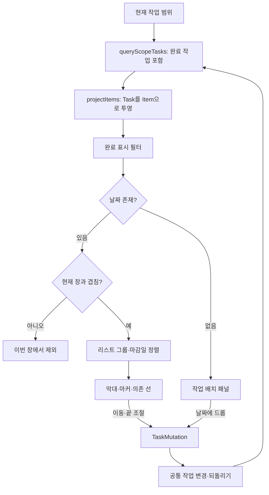

# FocusFlow Timeline Blueprint — 0.22.8

기준: 배포 태그 `v0.22.8`, 커밋 `c5c5326`. 현재 코드 연결을 기준으로 정리한 구성 문서다. 설계 계획과 현재 구현을 구분하며, 이번 작업에서 코드를 수정하거나 배포하지 않았다.

## 1. 타임라인의 역할

현재 타임라인은 **작업 화면의 간트 보기**다. 캘린더처럼 여러 종류의 일정을 합치는 화면이 아니라, 현재 범위에 속하는 작업의 시작·종료 날짜를 가로 막대로 보여준다.

- 작업 화면에서 타임라인 보기를 제공하는 범위에 진입한다. 예: `/list/{listId}?view=gantt`.
- 최상위 전역 타임라인 메뉴는 현재 구조에서 제거되어 있다.
- 같은 작업을 리스트·보드·타임라인으로 다르게 보여주며 별도 복제 데이터를 만들지 않는다.
- 입력 원본은 Task를 투영한 Item이다. 외부 ICS 일정과 집중 실적은 이 경로에 전달되지 않는다.
- 핵심은 작업 기간 비교, 날짜 없는 작업 배치, 일정 이동·기간 조절, 의존 관계 확인이다.

## 2. 화면 구성

```text
앱 전역 탐색 / 작업 탐색
└─ 현재 작업 범위
   ├─ 범위 제목 / 보기 선택 / 공통 작업 추가
   └─ 타임라인
      ├─ 도구막대
      │  ├─ 이전 / 오늘 / 다음
      │  ├─ 현재 시작일 – 종료일
      │  ├─ 줌: 1일 / 1주 / 1개월 / 6개월 / 1년
      │  └─ 완료 작업 표시
      └─ 본문
         ├─ 타임라인 그리드
         │  ├─ 고정 작업명 열 │ 시간·날짜 눈금
         │  ├─ 리스트 그룹 제목
         │  ├─ 색상 점 + 작업명 │ 기간 막대 또는 단일 날짜 마커
         │  ├─ 현재 시각 선 / 의존 관계 선
         │  └─ 가로·세로 스크롤
         └─ 작업 배치 패널 — 날짜 없는 작업이 있을 때
            ├─ 제목 + 개수
            ├─ 배치 안내
            └─ 드래그하거나 열 수 있는 작업 칩

작업명 / 막대 날짜 텍스트 클릭 → 공통 작업 상세 팝오버
```

### 각 영역의 책임

| 영역 | 내용과 동작 |
|---|---|
| 작업명 열 | 리스트 색 점, 작업 제목, 조건부 하위 작업 들여쓰기. 가로 스크롤에도 고정 |
| 눈금 헤더 | 줌별 시간/날짜/월. 세로 스크롤에도 헤더 유지 |
| 그룹 제목 | 리스트별 구분. 그룹 순서는 리스트 순서를 반영 |
| 작업 행 | 한 작업당 한 행. 기본 행 높이 32px |
| 기간 막대 | 실제 일정 길이에 비례해 배치. 막대 안에는 주로 날짜/시간 표시 |
| 작업 배치 패널 | 날짜가 전혀 없는 작업. 날짜가 있지만 화면 밖인 작업은 여기로 보내지 않음 |
| 작업 상세 | 기존 공통 상세를 열며, 타임라인 너비를 빼앗는 고정 오른쪽 열 대신 팝오버 사용 |

## 3. 시간 창과 줌

**기본값은 ‘1개월’이며 실제 범위는 5주다.** 달력의 매월 1일~말일과 다르다.

| 선택 | 한 열의 단위 | 열 수 | 범위 시작 | 최소 시간축 폭 |
|---|---|---:|---|---|
| 1일 | 1시간 | 24 | 기준 날짜 00:00 | 시간당 24px, 하루 576px |
| 1주 | 1일 | 7 | 기준 날짜 자체 | 하루 64px, 448px |
| 1개월 | 1주 | 5 | 기준 날짜가 속한 주의 시작 | 하루 16px, 35일 560px |
| 6개월 | 1개월 | 6 | 기준 월 1일 | 하루 7px × 범위 일수 |
| 1년 | 1개월 | 12 | 기준 월 1일 | 하루 4px × 범위 일수 |

- 위 폭은 작업명 열을 제외한 시간축의 최소 폭이다. 여유가 있으면 화면을 채우도록 늘어난다.
- 1년은 1월~12월 고정이 아니라 기준 월부터 12개월인 이동 범위다.
- 이전/다음은 현재 창 전체 길이만큼 이동한다. 1개월에서는 35일, 6개월에서는 6개월이다.
- 오늘은 기준 날짜를 오늘로 돌리고 가로 스크롤도 현재 시각을 볼 수 있게 재배치한다. 이미 오늘을 포함한 창이어도 작동한다.
- 현재 시각이 범위에 있으면 화면의 약 1/3 지점에 두어 앞으로의 일정을 더 보여준다.
- 화면이 좁아져도 범위 길이를 줄이지 않는다. 시간축을 가로 스크롤한다.
- 월별 열 폭은 같은 폭이 아니라 실제 시간 길이에 비례하므로 2월과 31일인 달의 폭이 다르다.

## 4. 작업이 화면에 도달하는 흐름



기본 ViewSpec은 `sources: task`, `groupBy: list`, `sort: dueDate`다. 타임라인 안에 별도 그룹 기준·정렬 기준 선택기는 없다.

완료 작업은 기본적으로 표시한다. 상위 작업 조회도 완료 작업을 포함하도록 별도로 조회한다. 완료 표시를 끄면 그리드와 날짜 없는 작업 배치 대상 모두에서 제외된다.

부모가 현재 표시된 경우에만 자식 작업명 앞에 들여쓰기와 ↳ 표식을 붙인다. 트리 전체를 접고 펼치는 계층형 간트 기능은 아니다.

## 5. 날짜 해석

| 원본 데이터 | 그리드 해석 |
|---|---|
| 시작일·마감일 모두 없음 | 날짜 없는 작업 패널 |
| 마감일만 있음 | 그 날짜의 하루 일정. 추론된 시작으로 취급 |
| 시작일만 있음 | 그 날짜의 하루 일정 |
| 시작일·마감일 모두 있음 | 두 날짜 중 이른 날부터 늦은 날까지 |
| 시작/종료 시간 있음 | 시간 좌표에 반영. 1일 줌에서 가장 분명하게 확인 가능 |
| 시작/종료 시간 없음 | 해당 날짜 전체를 차지하는 일정 |
| 계산한 종료 시각이 시작 이하 | 음수 막대 대신 날짜 전체 범위로 표시하는 방어 처리 |

- 표시를 위해 추론한 시작 날짜를 원본 Task에 자동 저장하지 않는다.
- 날짜의 종료는 마지막 날을 포함한다. 내부 위치 계산은 다음 경계를 제외하는 구간으로 계산한다.
- 화면 범위를 넘어가는 일정은 잘라서 보여주고 양 끝에 잘림 표식을 넣는다.
- 화면과 전혀 겹치지 않는 작업은 빈 행을 남기지 않고 제외한다.
- 시작·마감 날짜가 거꾸로인 데이터를 min/max로 그리는 것은 데이터가 정상이라는 뜻이 아니다. 원본 정정과 표시 방어는 별개다.

## 6. 막대의 형태와 의미

| 표현 | 의미 |
|---|---|
| 작업명 왼쪽 색 점 | 소속 리스트 색 |
| 밝은 색 막대 + 어두운 글자 | 리스트 색을 읽기 쉬운 배경으로 변환 |
| 날짜/시간 텍스트 | 막대가 차지하는 기간. 제목은 왼쪽 열에 표시 |
| 다이아몬드 마커 | 주보다 거친 열 단위에서 단일 날짜 작업을 점으로 표시 |
| 추론된 시작 스타일 | 원본에 확정 시작일이 없거나 다른 날짜에서 시작을 유도한 경우 |
| 완료 스타일·✓ | 완료된 작업. 체크박스 토글이 아님 |
| 차단 상태 스타일 | 선행 작업에 의해 막혀 있는 작업 |
| 선택 행 강조 | 공통 상세에서 선택된 작업 |
| ◀ / ▶ | 일정의 시작/끝이 현재 창 바깥에 있음 |

- 1주 줌의 단일 날짜는 하루 너비 막대다.
- 1개월·6개월·1년 줌의 단일 날짜는 다이아몬드다. 별도 milestone 데이터 유형을 만든 것이 아니다.
- 다이아몬드는 14px이며 끝 조절 핸들이 숨겨진다.
- 기간 막대는 너무 짧아 사라지지 않도록 최소 6px를 갖는다. 극단적으로 축소하면 최소 폭과 실제 비례 폭 사이에 차이가 있다.
- 막대가 좁으면 날짜 텍스트를 축약하거나 숨긴다. 작업명 열과 툴팁이 이름을 유지한다.
- 다크 모드에서는 밝은 배경을 그대로 쓰지 않고 색 대비를 조정한다.

## 7. 조작 계약

| 조작 | 결과 | 제약 |
|---|---|---|
| 작업명 클릭 | 공통 작업 상세 열기 | 키보드로도 버튼 접근 가능 |
| 막대 안 날짜 텍스트 클릭 | 막대 근처 공통 상세 열기 | 막대 외곽 전체가 동일 클릭 타깃인 것은 아님 |
| 막대 몸체 드래그 | 시작/끝을 함께 이동 | 잡은 위치부터 포인터 이동량 계산 |
| 왼쪽 끝 드래그 | 시작일, 필요하면 시작 시간 변경 | 화면 밖으로 잘린 끝에서는 핸들 없음 |
| 오른쪽 끝 드래그 | 마감일, 필요하면 종료 시간 변경 | 마커에서는 핸들 없음 |
| 날짜 없는 작업 칩 드롭 | 포인터 위치 날짜를 dueDate로 지정 | 1일 줌에서도 기본적으로 날짜만 배정 |
| 날짜 없는 작업 칩 클릭 | 공통 작업 상세 열기 | 드래그의 대체 경로 |
| 완료 작업 표시 | 완료 항목 포함/제외 | 작업을 실제 완료/미완료로 바꾸지 않음 |

### 이동·리사이즈 세부 규칙

- 1일 줌의 포인터 시간 해석은 15분 스냅이다.
- 시간 없는 작업의 이동은 날짜 단위다. 시간이 있는 작업은 시간 이동량을 반영한다.
- 원본에 없는 날짜/시간 필드를 몸체 이동만으로 임의 생성하지 않는 것을 기본으로 한다.
- 끝 조절은 사용자가 그 끝을 정한 것이므로 해당 날짜/시간 필드를 쓸 수 있다.
- 시간 단위가 아닌 줌에서 끝을 조절하면 기존 시간을 지우지 않는다.
- 포인터를 주/월 열 한가운데 놓으면 그 열 첫날이 아니라 실제 가리킨 날짜를 계산한다.
- 이동 거리가 0이거나 같은 위치로 놓으면 변경·동기화·되돌리기 알림을 불필요하게 만들지 않는다.
- 변경은 공통 mutation 경로로 전달되므로 되돌리기를 제공한다.
- 캘린더의 리사이즈와 달리 이 경로는 날짜/시간 patch를 만든다. 예상 소요 시간을 막대 길이로 자동 재계산하는 연결은 확인되지 않는다.

### 작업 배치 패널

날짜 없는 작업이 있을 때만 나타난다. 작업 개수를 별도로 표시하며, 칩을 끄는 동안에만 그리드 위 드롭 영역을 켠다. 성공적으로 놓거나 취소하면 드롭 영역을 제거한다. 날짜를 부여하면 작업이 패널에서 빠지고 그리드로 이동한다.

드롭은 `dueDate`를 지정한다. 시작 날짜를 자동 확정하거나 예상 시간만큼 기간을 배치하는 동작은 아니다.

## 8. 의존 관계

- 원본은 `Task.blockedByTaskId`다. 작업당 선행 작업은 하나, 선행 작업 하나에 여러 후속 작업은 가능하다.
- 두 작업이 화면에 있으면 선행 막대 오른쪽 끝 → 후속 막대 왼쪽 시작으로 꺾인 화살표를 그린다.
- 한쪽이 현재 창/범위 밖이면 남은 막대에 선행/후속 작업이 밖에 있다는 배지를 표시한다.
- 없는 선행 작업이나 삭제된 선행 작업을 영구 차단 관계로 그리지 않는다.
- 미해결 선행 작업의 종료 날짜보다 후속 작업의 시작 날짜가 빠르거나 같으면 충돌 표시를 한다.
- 선은 실제 DOM 막대 위치를 측정해 그리며 클릭을 가로채지 않는 장식 레이어다.

현재는 **관계 시각화와 충돌 표시**다. 선을 드래그해서 의존 관계를 생성하거나, 선행 작업을 옮겼을 때 후속 일정을 자동으로 밀어주는 기능은 없다.

충돌 판정은 날짜 수준이다. 같은 날 오전 선행 작업이 끝나고 오후 후속 작업을 시작하는 경우에도 날짜 조건상 충돌로 표시될 수 있다. 정밀한 시간 단위 Finish-to-Start 판정과 구분해야 한다.

## 9. 스크롤·반응형·상태 저장

- 작업명 열 기본 폭: 220px. 900px 이하에서는 130px.
- 시간축과 이름 열 사이 간격: 8px.
- 시간축 최소 폭보다 화면이 좁으면 가로 스크롤하고, 작업명 열은 제자리에 유지한다.
- 세로로 내려가도 눈금 헤더가 유지된다. 긴 시간축에는 앱 자체 가로 스크롤바를 제공한다.
- 가로 스크롤 제스처가 브라우저 뒤로 가기에 전달되지 않도록 overscroll을 제한한다.
- 좁은 화면에서 날짜 없는 작업 패널은 아래로 내려가 한 줄 전체 폭을 사용할 수 있다.
- 줌·기준 날짜·완료 표시·오늘 재중앙화·드래그 상태는 TaskGanttView의 로컬 React 상태다. 해당 컴포넌트에서 영속 저장하지 않는다.
- 어떤 보기인지 선택하는 작업 화면 라우트/상태와, 그 보기 안의 줌 상태는 별개다.
- 현재 시각 선은 렌더 시 계산하며 독립 타이머로 계속 갱신하지 않는다.

## 10. 캘린더와 비교

| 항목 | 타임라인 | 캘린더 |
|---|---|---|
| 주 대상 | 작업 기간 | 작업 + 외부 구독 일정 + 집중 실적 |
| 행의 의미 | 작업 하나 | 날짜/시간 구획 |
| 기간 일정 | 한 행의 연속 막대 | 날짜별 항목으로 투영 |
| 날짜 없는 작업 | 별도 배치 패널 | 현재 미예약 패널 없음 |
| 빈 영역 생성 | 직접 생성 UI 없음, 작업 추가/배치 사용 | 일·주 빈 시간 클릭/드래그 초안 |
| 완료 처리 | 상세에서 처리, 표시 필터 제공 | 블록 체크박스 제공 |
| 의존 관계 | 선·배지·충돌 표시 | 시간 겹침 배치 중심 |
| 시간 밀도 | 5단계 줌 | 일·주·월·연 보기 |
| 겹침 | 작업마다 별도 행 | 같은 시간의 여러 항목을 나눠 배치 |

## 11. 현재 한계와 확인할 사항

1. **완료 작업의 드래그 가능 표시와 저장 대상이 불일치할 가능성:** 렌더러는 Task이면 드래그를 켜지만, 상위 `ganttContext.taskById`는 완료 포함 `ganttRows`가 아닌 일반 `rows`로 만든다. 완료 작업은 보이지만 조회 맵에서 누락되어 드래그가 아무 변경 없이 끝날 수 있다. 현재 코드에서 확인한 연결 차이이며 실제 범위별 재현 검증이 필요하다.
2. **주 시작일:** 1개월 정렬은 `getWeekStart` 기본값을 사용한다. 캘린더의 사용자 월요일 시작 설정을 명시적으로 전달하지 않는다.
3. **일광절약시간:** 열 폭은 실제 시간 차를 사용하지만 날짜 전체 끝 경계는 일부 계산에서 자정 + 86,400,000ms를 사용한다. DST 전환일의 막대 길이·위치 일관성은 추가 검증 대상이다.
4. **완료 체크박스·진행률 편집 없음:** ✓ 표시는 상태 표시다. 퍼센트 진행률 막대나 진행률 핸들은 없다.
5. **의존성 자동 일정 조정 없음:** 충돌 경고를 그려도 날짜를 자동 수정하지 않는다.
6. **드래그는 HTML Drag and Drop 기반:** 터치와 키보드에서 동일한 직접 조절 경험이 보장되는 것은 아니다. 공통 작업 상세에서 날짜 편집은 가능하다.
7. **다이아몬드 상세 진입:** 마커의 날짜 텍스트 버튼은 CSS로 숨긴다. 작업명 버튼은 남아 있으므로 그 경로로 상세를 연다.
8. **기준선·임계 경로·자원 부하·다중 작업 일괄 이동·프로젝트 자동 합산 막대·간트 내 의존선 편집은 현재 제공 기능으로 확인되지 않는다.**
9. 가상화가 없으며 표시 작업마다 행을 렌더링한다. 줌 열 수는 최대 24개로 고정하지만 대량 작업의 성능은 별도 측정이 필요하다.

## 12. 검증 항목과 소스 지도

후속 검증은 줌별 범위/막대 길이, 날짜 없는 작업 배치, 시간 보존 이동, 끝 조절, 되돌리기, 완료 항목, 화면 밖 의존 배지, 가로/세로 고정 영역, 좁은 화면, DST 경계를 중심으로 진행하면 된다.

| 책임 | 소스 |
|---|---|
| 범위 조회·색·공통 상세·변경 연결 | `src/components/tasks/TasksModule.tsx` |
| 줌·기간 이동·완료 필터·작업 배치 | `src/components/TaskGanttView.tsx` |
| 그리드·행·막대·드래그·스크롤 | `src/components/TimelineView.tsx` |
| 의존선 DOM 측정·SVG | `src/components/TimelineConnectors.tsx` |
| 줌 창·열·시간 좌표·막대 위치 | `src/domain/view/timeline.ts` |
| 날짜 범위 투영 | `src/domain/view/span.ts` |
| 이동·리사이즈·배치 mutation | `src/domain/view/board.ts` |
| 의존 관계·충돌·외부 배지 | `src/domain/view/connectors.ts` |
| 기본 그룹과 정렬 | `src/domain/view/spaceViews.ts` |
| 외형·고정 열·축약·다크·반응형 | `src/styles/12-timeline.css` |
| 브라우저 테스트 | `e2e/ganttBars.spec.ts`, `ganttScroll.spec.ts`, `ganttCompleted.spec.ts` |
| 컴포넌트/도메인 테스트 | `src/components/taskGanttArrange.test.tsx`, `src/domain/view/timeline.test.ts` |
